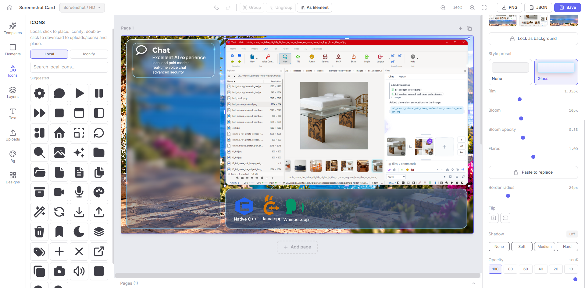

<h1 align="center">OpenDesign</h1>

<p align="center">
  <strong>Local canvas editor for app-store screenshots.</strong>
</p>

<p align="center">
  Fork of <a href="https://github.com/clawnify/OpenDesign">clawnify/OpenDesign</a> · published as <code>@polymech/opendesign</code>
</p>

Design stills (store listings, feature cards, HD captures) as Fabric canvases on disk, then export PNG without opening the UI.

## Quick start

```bash
npm i -g @polymech/opendesign
cd your-project
pm-opendesign
```

That's it. The editor opens in the browser. Tabler icons ship in the package.

Or without installing:

```bash
npx @polymech/opendesign
```

Original: [clawnify/OpenDesign](https://github.com/clawnify/OpenDesign). This fork is a local CLI — no Cloudflare Workers, no Wrangler, no cloud storage.

## What we changed

- **`pm-opendesign`** — one process serves the UI and API, then opens the browser
- **Folders, not cloud** — JSON + files on disk. No D1, R2, or Wrangler
- **Merged libraries** — project + global uploads, icons, templates, and elements all show up together (union; project wins on the same name)
- **Published `dist` only** — one client bundle, one CLI bundle, plus Tabler filled icons
- **Editor** — named groups, glass, snap guides, Iconify search, extra shapes / gradients / opacity, copy-paste
- **Headless PNG** — Chrome/Edge renders the same canvas the editor uses (for store screenshots)

## Storage

| | Path |
|---|---|
| Project | `<cwd>/.OpenDesign/` |
| Global | `%APPDATA%/OpenDesign` or `~/.OpenDesign` |

New designs and uploads go to the project folder. Iconify downloads go to the global icon library.

## CLI

```
pm-opendesign [--port 3727] [--no-browser]
pm-opendesign ls
pm-opendesign export [id|name] [-o out.png] [--page 1] [--scale 2]
```

### Headless export

`export` is how you turn a saved design into a store screenshot from a script. It is **not** node-canvas.

1. Node starts the local API + client on localhost
2. Chrome or Edge opens `/export/:id` with `--headless=new` (set `OPEND_BROWSER` if it cannot find one)
3. The page loads Fabric JSON, fetches uploads/icons, draws, and POSTs the PNG back
4. Node writes the file, then kills the browser

Same 2× PNG as the toolbar (`--scale`). Needs a built client (`npm run build` in this repo, or the published package).

Logs go to **stderr** (`[export] ...`). The PNG path is the only stdout line. Missing backgrounds, images, and icons are tagged `MISSING`. Localhost URLs from the dev server (`http://127.0.0.1:5174/api/...`) are rewritten to `/api/...` so headless hits the export port.

```bash
pm-opendesign ls
pm-opendesign export "Screenshot Card" -o store/iphone.png --scale 2
```

## Dev (this repo)

```bash
cd infrastructure/OpenDesign
npm install
npm run dev
```

`npm run build` writes `dist/cli.js`, `dist/client/`, and `dist/tabler-icons/`.

## License

MIT. Upstream copyright Clawnify; this fork Polymech. Tabler icons are MIT ([tabler/tabler-icons](https://github.com/tabler/tabler-icons)).


